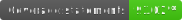

# QEventBroker

QEventBroker is an API which provides event broker functionality: dispatch and subscribe to events via observables.

**NOTE:** this is a work in progress and should not yet be used in any production software.

# Install

`npm install q-event-broker